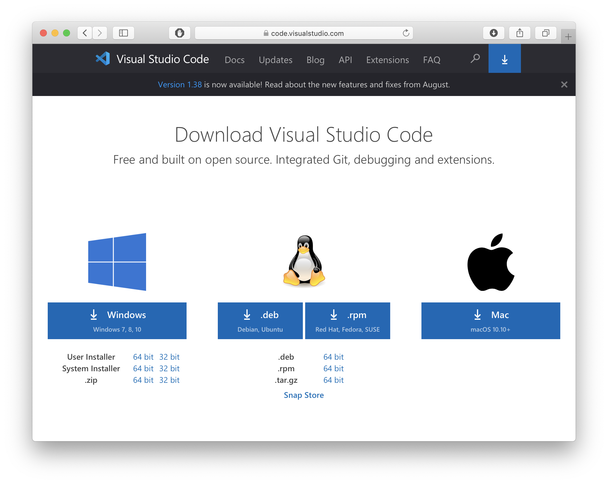
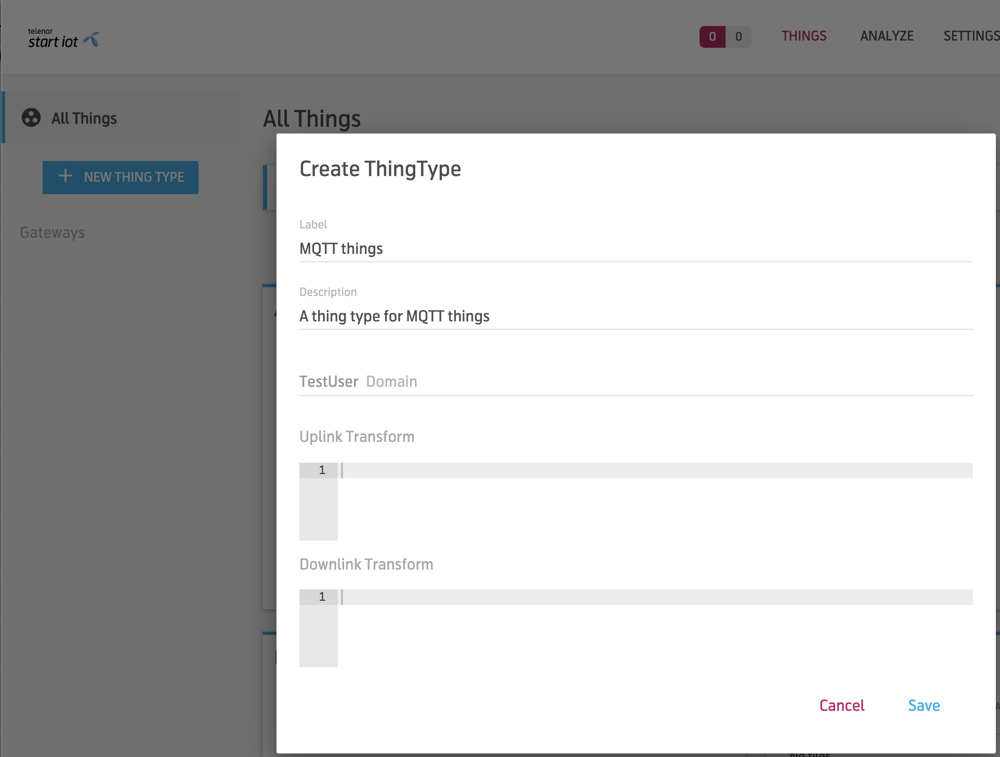
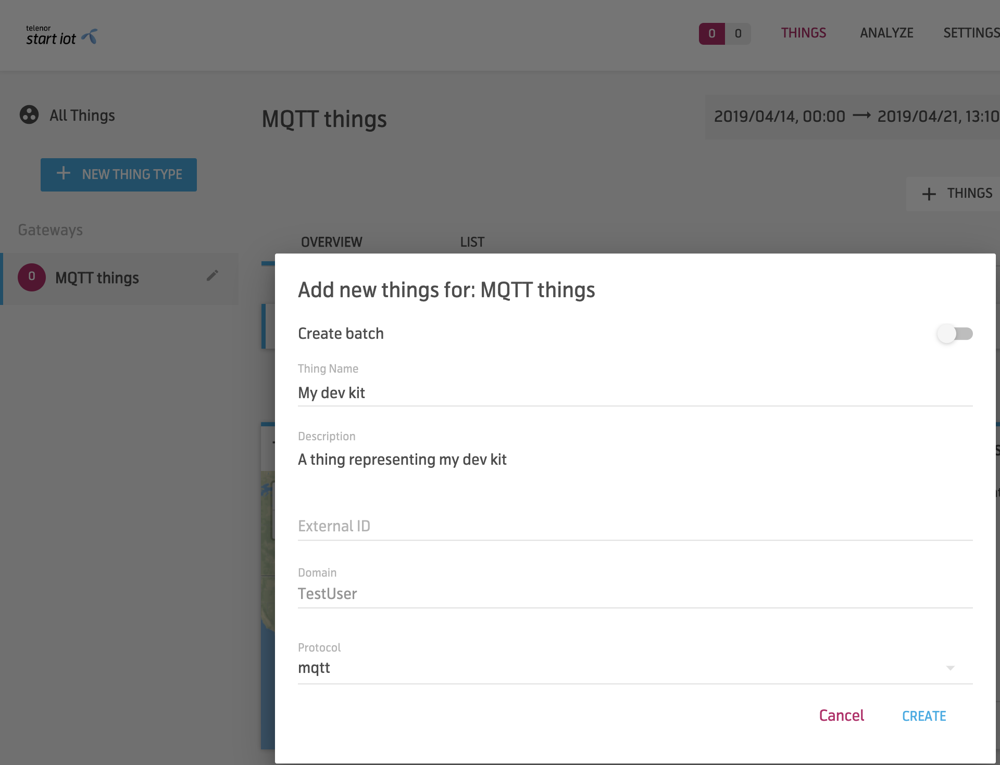
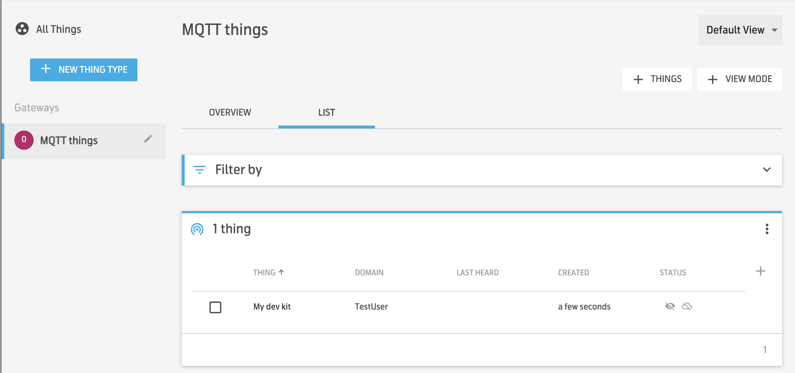
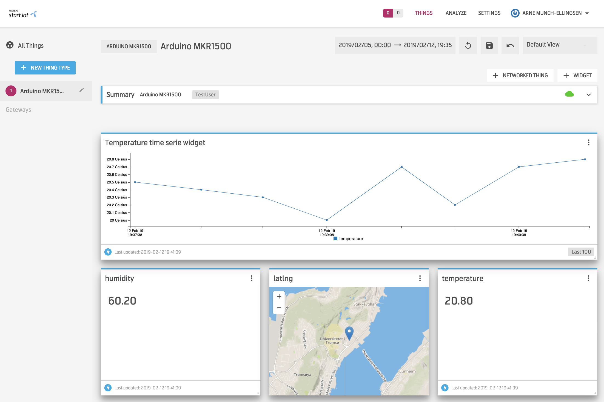
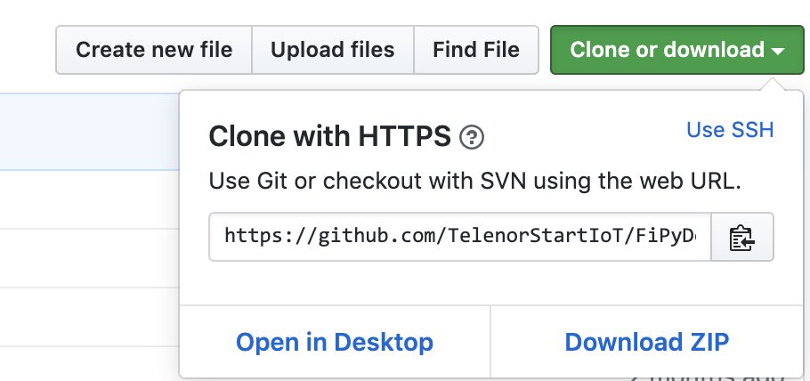

# Get Started With the FiPy Dev-Kit (MQTT/TLS 1.2 over NB-IoT or LTE-M)

> Reading time: 45 minutes

This tutorial gives brief instructions on how to get started with the FiPy dev-kit. This tutorial will send data using the MQTT protocol using TLS 1.2 encryption directly to Telenor Managed IoT Cloud (MIC) over the LTE-M (Cat M1) or NB-IoT (NB1) network.

You will learn how to:

   * download and install the VSCode editor and the Pymakr plugin
   * assemble the dev-kit and connect it to the VSCode editor
   * create a Telenor Start IoT Managed IoT Cloud (MIC) platform account
   * register your dev-kit in MIC and create payload transformations
   * flash the modem firmware on the FiPy (to support either LTE-M or NB-IoT)
   * program the dev-kit and send data to MIC using MQTT over Telenor's excellent 4G LTE-M or NB-IoT network
   * view your data in MIC

You can also find a lot of info related to the FiPy on Pycom's own documentation site: https://docs.pycom.io/gettingstarted/

## Contents

  1. Chapter One
     1. Sub Header
     2. Sub Header 2
  2. Chapter Two
     1. Sub Header
     2. Sub Header 2

## 1. Download and Install the VSCode Editor and the Pymakr Plugin

This Chapter will show you how to download and install the VSCode editor and the Pymakr plugin for the VSCode editor. The VSCode editor is what you will use to connect to and program your dev-kit.

### Download the VSCode Editor

The easiest way to program the FiPy is to use the VSCode editor and install the Pymakr plugin for the VSCode editor. You can download the VSCode editor for Windows, Linux and MacOS here: https://code.visualstudio.com/download. Download and install the VSCode editor for your operating system.



### Install the Pymakr Plugin for VSCode

When you have successfully installed the VSCode editor
When you have successfully installed the VSCode editor you need to enable VSCode to connect over USB to the FiPy dev-kit. For that, the VSCode editor needs the Pymakr plugin. You should follow the instructions given by Pycom in order to install the plugin. Note: You should not try to follow the "Connect via serial USB" part just yet: https://docs.pycom.io/pymakr/installation/vscode/


When both the VSCode editor and the Pymakr plugin have been successfully installed you are ready to connect and start programming your own firmware for the FiPy. The next chapter will show you how to connect your dev-kit to the VSCode editor.

## 2. Assemble the FiPy Dev-Kit

In this chapter you will learn how to assemble and connect the FiPy dev-kit to the VSCode editor. You will also communicate with the dev-kit in order to check the firmware version and retrieve the IMSI and IMEI numbers that you will need to register you dev-kit in the MIC platform. More on that in a later chapter, let us first connect the dev-kit to VSCode.

### Attach the Antenna

**Important**: You should always mount the 4G antenna to the connector on the bottom side of the FiPy . The result of not connecting the antenna could be that you harm the modem when it is connected. You should insert the provided SIM card in the SIM card slot on the bottom side of the FiPy. If you do not have the SIM inserted it will be impossible to connect to the 4G network.


### Insert the SIM and Mount FiPy on the Expansion Board

You should now mount the FiPy module to the provided Expansion Board. The USB connector on the expansion board must be in the same direction as the reset button on the FiPy module. The image shows you what it should look like. You should check that all the jumper switches on the Expansion board is present. The jumper switches are the small plastic jumpers located on the upper left side of the expansion board. Without all the jumpers in place it might be impossible to get contact with the FiPy. You should also check that all the PIN's on the FiPy are matching the open connectors on the expansion board (i.e. that it is aligned correctly) when you push the FiPy model into the expansion board.


Insert the Nano SIM card.


Mount the FiPy on the Expansion board.

### Connect the FiPy to the VSCode Editor

You are now ready to follow the "Connecting via serial USB" procedure described here: https://docs.pycom.io/pymakr/installation/vscode/#connecting-via-serial-usb

As a result, you should now be able to connect to the FiPy dev-kit using a USB port on your computer. The Pymakr plugin will automatically detect your dev-kit and connect VSCode to it. You should note that the micro USB cable is not supplied with the dev-kit.

If you select the "All commands" button (located at the bottom bar) and then select "Get board version" in the VSCode Pymakr menu you should see the version number of the underlying Pycom Firmware.

In the next chapter you will need the IMSI and IMEI numbers of the dev-kit. To get that, type the following in the REPL (after the >>>) and include carriage return (press enter) after each line. Make a note of the IMSI and IMEI numbers displayed (or just keep the VSCode editor open and available).

``` python
from network import LTE
lte = LTE()
lte.send_at_cmd("AT+CIMI")
lte.send_at_cmd("AT+CGSN")
```

<Picture of terminal here>

### Upgrade the Pycom Firmware

It should be OK to use the firmware that is pre-installed on your FiPy but you should upgrade it following the procedures here when new versions are made available: https://docs.pycom.io/gettingstarted/installation/firmwaretool.html

## 3. Register Your FiPy Dev-Kit in Telenor Managed IoT Cloud as an MQTT Thing

In this chapter you will learn how to register your dev-kit to Telenor Start IoT Managed IoT Cloud (MIC). You will learn how to add a new MQTT "Thing" in MIC. You will also learn how to create a dashboard to display your data in MIC. When sending MQTT data to MIC it will be possible to view the separate values in the MQTT publish packet in MIC widgets. Widget types in MIC ranges from simple textual widgets to graphical representations of your data.

### Sign Up For a MIC Platform Account

You will have to register for a MIC account in order to register your dev-kit. You can do that here: https://demonorway.mic.telenorconnexion.com


Click on the "Sign Up" button in the upper right corner and follow the instructions in order to sign up. You should be aware that the signup is a two phased sign up. It therefore requires that you, in phase one, verify your email. We will send a link to the email you register and you will have to use the link to verify your email address. In phase two, we will manually register your private MIC domain and activate your account. You will then receive a second email stating that your account has been activated. Because of this procedure it may take up to 24 hours before your account is ready to be used.

### Add a New Thing Type

You will now have to login to your MIC account when it is ready for use. When logged in you must create a new "Thing Type" for your dev-kit. A "Thing Type" is a way to organize multiple "Things" that share similarities.

To add a new "Thing Type" click on the "+NEW THING TYPE" button and fill in the form. For things that are of type MQTT it is not necessary to add uplink or downlink transformations since the thing will send data following the MIC MQTT shadow update format. This format is directly understood by MIC.



### Add a Thing Representing Your Dev-Kit

The "Thing Type" and "Thing" together is a representation of your dev-kit in MIC. It is possible to have more than one thing in a Thing Type and this will make the Things in the Thing Type behave in the same manner with respect to how payloads from the Things are handled. The handling of the payload is described in your uplink transformation.

You must click on the "+THINGS" button to create a new Thing. In the create new Thing form, de-select the "Create batch" slider. You must then add a "Thing Name", a "Description", select your "Domain" and choose "mqtt" as "Protocol" for your Thing. The image shows an example of what it should look like.



### See Your Newly Created Thing

You can look at and access your Thing if you click the "List" tab. The image shows an example list of devices reflecting a single dev-kit Thing.



### Example Dashboard

If you click on the "Thing name" in the list you will create a dashboard for your Thing. The dashboard will be mainly empty until the first payload for your Thing arrives. The dashboard is configurable and you can add widgets that represents values sent from your dev-kit (called resources). The image shows a very simple dashboard for the dummy payload sent from your device. It is possible to add more advanced widgets. Play around!



### Start Programming!

It is now time to start programming the dev-kit. In the next chapter we will show you how.

## 4. Flash FiPy for NB-IoT or Update the LTE-M Firmware

Currently the FiPy comes with two separate modem firmware images. One image is for NB-IoT (NB1) and the other image is for LTE-M (Cat M1). Unfortunately only one of the modem images can be used at a time but we hope that this will change in the future, and that it will be possible to switch between the two network types in your own program for the FiPy without having to flash the modem.

From the factory the FiPy is configured with the LTE-M (Cat M1) modem firmware, so if you want to use the LTE-M network you do not have to flash the modem with new firmware and you can skip this chapter.

It could however be a good idea to upgrade the LTE-M firmware when new versions are released. Detailed instructions on how to update the LTE-M firmware or switch to NB-IoT firmware can be found here: https://docs.pycom.io/tutorials/lte/firmware.html

## 5. Program the FiPy Using MQTT (LTE-M or NB-IoT)

In this chapter you will learn how to program the FiPy dev-kit. The chapter will guide you through how to use the provided example code to connect the FiPy to the LTE-M or NB-IoT networks. Be aware that the FiPy Sequans modem firmware can only support either LTE-M (Cat M1) or NB-IoT. If you want to experiment with the NB-IoT network you will have to flash the Sequans modem on the FiPy with the NB-IoT firmware first.

In this chapter you will learn how to program the FiPy dev-kit to send data using MQTT directly to MIC. The chapter will guide you on how to use the provided example code to connect the FiPy to the LTE-M (Cat M1) or NB-IoT (NB1) IoT networks. The example code prepares and publishes dummy messages directly to Managed IoT Cloud over the LTE-M (Cat M1) or NB-IoT (NB1) network.

### Download Example Code

You can download the example code from here: https://github.com/TelenorStartIoT/FiPyDevKitCatM1

You should choose the "Download ZIP" option in the "Clone or Download" button pop-up. This will download a ZIP archive with the example code.



### Unzip the Example Code and Open It In VSCode

Unzip the example code. How to do this varies depending on your computer system. Most systems will unzip it if you double click on the zip file.

Open the folder using the "File > Open Folder" ("File > Open" on MacOS) option in VSCode.


### Download the Certificates and Keys From MIC

Download the certificates and keys for your Thing as the image shows (you will get a ZIP file). Unzip the downloaded file and and add the content to the "cert" folder in the code project (remove old certificates and keys from this folder if present).


### Modify the Program's MQTT Configuration

You will have to change the MQTT configuration defined in the config.py file of the downloaded program to reflect your thing (i.e. change the Thing ID in the configuration).

To see your Thing ID, click on the + sign in the list view and check the unchecked Thing ID box (see image). Note your Thing ID in the list view and change the following in the config.py file:

   * Remove the # to uncomment the lines TOPIC, DOWNLINK_TOPIC and CLIENT_ID lines
   * Change the TOPIC to reflect your thing (i.e. change 00001721 to your things id)
   * Change the DOWNLINK_TOPIC (i.e. change 00001721 to your things id)
   * Change the CLIENT_ID (i.e. change 00001721 to your things id)

### Modify the Program's Network Configuration

The program you downloaded has the network (modem) configuration that should be used to connect to the NB1 network. If you are using the M1 network change the initModem function in the main.py file by commenting out the four lines shown on the right.

### Run the Program

Connect the FiPy that is mounted on the expansion board to your computer (if not already connected). Make sure that the SIM and LTE antenna is connected! The Pymakr plugin in VSCode will automatically detect the dev-kit.

To upload and run the program on your FiPy, simply click the "Upload" button located at the bottom bar. This will first upload the code, the certificates and key, then it will reset your FiPy and run the uploaded code.

### Check the Output From the Program

If everything goes well you should see output from the program in the Pycom Console window in VSCode. The image shows you what it could look like (the output from the program might be different).

### Wrapping It All Up

You should now be able to view your data in the MIC dashboard. Try to add a time series widget by clicking the “+WIDGET” button in MIC and set the type to be "Time Series". Images below shows some sample screenshots on how to do it.

### Happy Hacking!

This concludes the Get started with the FiPy tutorial. Your next step could be to connect the supplied DHT11 sensor to the FiPy and to modify the "dummy" payload string with values from the DHT11 sensor.

A god starting point would be to use the library code supplied here:

https://github.com/JurassicPork/DHT_PyCom/tree/pulses_get

Happy hacking!
